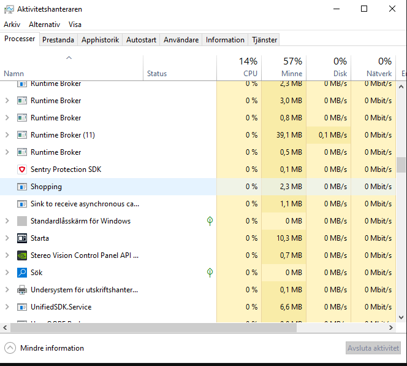

# Kunskapskontroll 2 – Inköpslista

## Debugging Notes and Observations

### 1. Testing Invalid Input

**Instruction:** Skriv bokstäver där programmet vill ha ett tal.

**My interpretation:** Does this mean every line in the program that expects a number?

For example:
- Menu choice
- Product price
- Product number when removing an item

The goal is to test what happens when the user enters something unexpected, such as `hej` instead of a number.

### 2. Removing a Product That Doesn't Exist

**Instruction:** Ta bort en vara som inte finns.

**My comment:** I found this instruction confusing because I interpreted it as removing a line of code from the program.

What I need to test is what happens when the user tries to remove a product that isn't in the list.

### 3. Where IS THE PRODUCT?!

I need to understand where the product goes after I add it, and how the program stores and displays it.

I also need to slow down and follow the code step by step instead of changing several things at once.

---

## __1__ Starting the Program

###  Issue 1: `IndexOutOfRangeException`

**Error message:**

`System.IndexOutOfRangeException: Index was outside the bounds of the array.`

**Location:** `ShoppingList.cs`, line 90.
 
**What it means:** The program tried to access an array position that doesn't exist.

**Code:**

```csharp
items.Add(new Item(parts[1], int.Parse(parts[3])));
```

**My initial thought:** We changed the index from `0` to `3` because we thought we had three parts (three products).

**What I need to understand:** An index is a position, not the number of products. Index `0` is the first element, `1` is the second, `2` is the third, and `3` is the fourth.

Changing the index to `3` only works if the array actually contains at least four elements.

### Issue 2: Empty Lines in the Saved File

I noticed that the saved file could contain an empty line or whitespace.

We added this check:

```csharp
if (string.IsNullOrWhiteSpace(line))
{
    continue;
}     
```
ref: 87,10 in shoppinglist

**What it does:** It skips empty lines and lines containing only whitespace, so the program doesn't try to process them as products.

### Issue 3: Error Pointing to `Program.cs`, Line 2

**Error location:**

`Program.<Main>$(String[] args) in Program.cs:line 2`

After making the changes, the program could start running again.

**My observation:** The list disappear, and I could run the code.

**What I need to investigate:** is the list needed, or will can we go trou without the list?

---

## Lessons Learned So Far

### 1. Understanding Error Messages

- Read the entire error message and identify the file and line number.
- Identify the exception type and what it means.

### 2. Understanding Arrays

- An array index represents a position, not a number of products.
- Check the number of elements before accessing an array index.

### 3. Handling Saved Data

- Skip empty lines when reading saved data.
- Verify whether products are loaded and displayed correctly.

### 4. Debugging Approach

- Test one change at a time.
- Distinguish between fixing a crash and fixing the underlying problem.
- Verify whether a product is added, saved, loaded, and displayed correctly.
- Slow down and understand why a change works instead of just making the error disappear.




Key lesson: If you see MSB3027 or MSB3021 and a message about a file being used by another process, check whether your previous application instance is still running.

"Shopping (11948)" "The file is locked by.

# Testing Invalid Input – Letter Instead of int

## Purpose
Test what happens when the user enters a letter or text instead of an integer (`int`) when the program expects a numerical value.

## Problem
When the program uses `int.Parse(Console.ReadLine())`, it attempts to convert the user's input into an integer. If the user enters something like `a` or `hello`, a `FormatException` occurs.

## Solution – try-catch and continue

```csharp
try
{
    choice = int.Parse(Console.ReadLine());
}
catch (FormatException)
{
    Console.WriteLine("Please enter a number!");
    continue;
}
```

- `try` executes code that might cause an exception.
- `int.Parse()` attempts to convert the input into an integer.
- `catch (FormatException)` catches the error if the input has an invalid format.
- `Console.WriteLine()` displays an error message to the user.
- `continue` skips the rest of the current loop iteration and starts the next one, allowing the user to try again instead of terminating the program.


## Result
The program can handle letters and text entered where an integer is expected. The user receives an error message and can continue using the program.

## Important Concepts

- `int.Parse()` – converts a string into an integer.
- `FormatException` – occurs when the input has an invalid format for the conversion.
- `try-catch` – handles exceptions so the program can respond to errors.
- `continue` – skips the current iteration and proceeds to the next one.

### __2__ Ta bort en vara som inte finns.
-----


 ```else if (choice == 2)
    {
        Console.Write("Nummer: ");

        try
        {
            int number = int.Parse(Console.ReadLine()); // has to be in the try. 

            if (number > 3)
            {
                Console.WriteLine("Varan finns inte i listan.");
                Console.ReadLine();
            }
```
Wouldn't take away the item from the list, neither give an error if the list doesn't contain the product. So whe gotta refer to the list somehow

```Console.Write("Ange numret på varan som ska tas bort: ");
        if (!int.TryParse(Console.ReadLine(), out int number))  // a ! false sign to catch if the user writes letters instead of numbers
        {
            Console.WriteLine("Du måste skriva ett nummer.");
            continue;
        }

        if (number < 1 || number > list.Count) // Yeah we had this one here too before. but then we didnt have the count public int Count => items.Count;
        {
            Console.WriteLine("Varan finns inte i listan.");
            continue;
        }
```
Had to create the the property that returns the number of items in the list ref: Shoppinglist 7,5


## __4__ Arbetat med: # Lägg till en vara, spara, avsluta och starta om. Ser listan likadan ut?
## Svar: Det gör den ej, sparar ej och hoppar rows. Sidnote the format can be deliberately adjusted if u save the list after u have added for instance rows to items.cs ? 

### 1. Save() – Spara inköpslistan

Metoden `Save()` sparar inköpslistans varor i filen `items.txt`.

```csharp
lines.Add($"{item.Price};{item.Name}");
```

Varje vara sparas på en egen rad med priset först och namnet efter semikolonet.

Exempel på innehållet i `items.txt`:

```text
50;Mjölk
20;Bröd
3;Äpple
```

Vi använde `File.WriteAllText()` för att skriva informationen till filen.

### 2. Load() – Läsa in inköpslistan

Metoden `Load()` läser in den sparade informationen från filen.

```csharp
string text = File.ReadAllText(path);
string[] lines = text.Split('\n');

```
Once we delete the items.txt we gotta make sure  the condition is true when the file is missing and `Load` starts, read only starts at F.ReadAllText(path); Othwie the file gives the FileMissingError
```
           if (!File.Exists(path))
        {
                return;
        }
```

- `File.ReadAllText(path)` läser hela filens innehåll som en sträng.
- `Split('\n')` delar upp texten i separata rader.
- `foreach` går igenom varje rad i arrayen.
- `string.IsNullOrWhiteSpace(line)` kontrollerar om raden är tom eller bara innehåller blanksteg.
- `continue` hoppar över den aktuella iterationen och går vidare till nästa rad.

Detta gör att tomma rader i filen inte skapar några nya objekt i inköpslistan.

### 4. Split() – Dela upp pris och namn

Efter att filen har delats upp i rader delar vi varje rad vid semikolonet.

```csharp
string[] parts = line.Split(';');
items.Add(new Item(parts[1], int.Parse(parts[0])));
```

Exempel:

```text
50;Mjölk
```

Arrayen `parts` får följande värden:

- `parts[0]` innehåller `"50"` – priset.
- `parts[1]` innehåller `"Mjölk"` – varans namn.

Vi använder `int.Parse(parts[0])` för att omvandla priset från en sträng till ett heltal.

Sedan skapas ett nytt `Item`-objekt med namnet och priset, som läggs till i listan.

### 5. Skillnaden mellan Save(), Load() och Print()

| Metod | Ansvar |
|---|---|
| `Save()` | Sparar varorna till filen. |
| `Load()` | Läser in varorna från filen. |
| `Print()` | Visar varorna i konsolen. |
| `Total()` | Beräknar den totala kostnaden. |

Det är viktigt att skilja på att spara data, läsa in data och skriva ut data. Ett problem med utskriften behöver inte betyda att själva listan eller filen är felaktig.

### 6. Felsökning och resultat

Under arbetet upptäckte vi följande problem:

- `Load()` delade först upp hela filen vid semikolon i stället för att dela upp den vid radbrytningar.
- Detta gjorde att informationen inte delades upp på rätt sätt.
- Vi ändrade den första uppdelningen till `Split('\n')`.
- Vi lade till en kontroll som hoppar över tomma rader.
- Vi kontrollerade att pris och namn lästes in från rätt positioner i arrayen.
- Vi undersökte även hur extra radbrytningar i konsolen kan uppstå.
- Upptäckte hur lätt det är att placera kod "fel" ref: 12,5

**Resultat:** Inköpslistan kunde sparas till fil och läsas in igen med både namn och pris. Vi identifierade även skillnaden mellan tomma rader i konsolutskriften och tomma objekt i listan.
v

#### 2 side (2 chapter )

C:\Users\peter\Desktop\Kunskapskontroll2-Inkopslista\Program.cs(61,5): error CS1022: Type or namespace definition, or end-of-file expected
C:\Users\peter\Desktop\Kunskapskontroll2-Inkopslista\Program.cs(61,6): error CS8641: 'else' cannot start a statement.
C:\Users\peter\Desktop\Kunskapskontroll2-Inkopslista\Program.cs(61,6): error CS1003: Syntax error, '(' expected
C:\Users\peter\Desktop\Kunskapskontroll2-Inkopslista\Program.cs(61,6): error CS1525: Invalid expression term 'else'
C:\Users\peter\Desktop\Kunskapskontroll2-Inkopslista\Program.cs(61,6): error CS1026: ) expected
C:\Users\peter\Desktop\Kunskapskontroll2-Inkopslista\Program.cs(61,6): error CS1002: ; expected
C:\Users\peter\Desktop\Kunskapskontroll2-Inkopslista\Program.cs(85,1): error CS1022: Type or namespace definition, or end-of-file expected


__3__ #### Ta bort en vara som inte finns
--------------------------------------------------

### Unhandled exception. System.ArgumentOutOfRangeException: Index was out of range. Must be non-negative and less than the size of the collection. (Parameter 'index')
### at System.Collections.Generic.List`1.RemoveAt(Int32 index)
### at ShoppingList.RemoveAt(Int32 number) in C:\Users\peter\Desktop\Kunskapskontroll2-Inkopslista\ShoppingList.cs:line 20
### at Program.<Main>$(String[] args) in C:\Users\peter\Desktop\Kunskapskontroll2-Inkopslista\Program.cs:line 30

The index is out of range. Cant be negative and less than the "amount"
Belive that the list changed now tho as i only type "Mjölk" 20 no ? 17:33 09-30-26
The Case didnt go as it got removed at. 
"Yeah that worked but why did i have to comment out the removeat?"
Chat- The number input got removed and gave the error. 