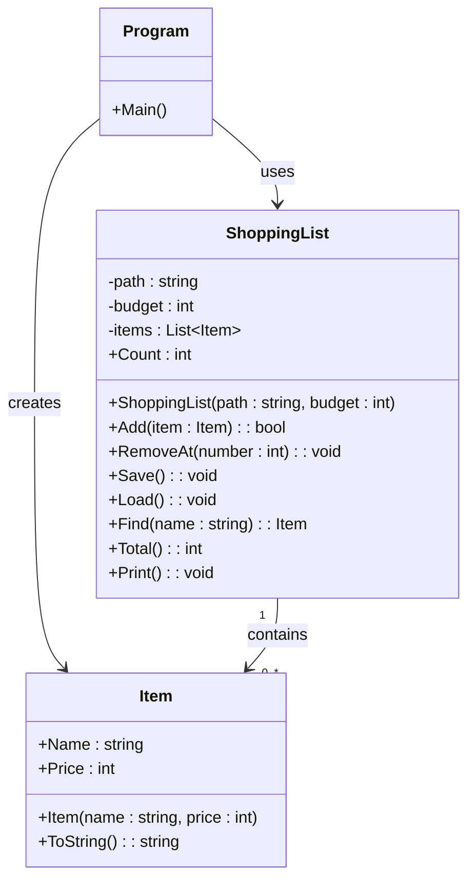

# __Kunskapskontroll 2 – Inköpslista__

## Debugging Notes and Observations

### __1. Testing Invalid Input__


For example:
- Menu choice
- Product price
- Product number when removing an item


The goal is to test what happens when the user enters something unexpected, such as `hej` instead of a number.


---

## __1 Starting the Program__

###  Issue 1: `IndexOutOfRangeException`

**Error message:**

`System.IndexOutOfRangeException: Index was outside the bounds of the array.`

**Location:** `ShoppingList.cs`, line 90.
 
**What it means:** The program tried to access an array position that doesn't exist.


```csharp
items.Add(new Item(parts[1], int.Parse(parts[3])));
```


### Issue 2: Empty Lines in the Saved File

I noticed that the saved file could contain an empty line or whitespace.

We added this check:

```csharp
if (string.IsNullOrWhiteSpace(line))
{
    continue;
}     
```
ref: 87,10 in shoppinglist.
The line thats being typed cant be null or whitespace in datatype string

**What it does:** It skips empty lines and lines containing only whitespace, so the program doesn't try to process them as products.


# __Testing Invalid Input – Letter Instead of int__

Purpose
test what happens when the user enters a letter or text instead of an integer (`int`) when the program expects a numerical value.

## Problem
When the program uses `int.Parse(Console.ReadLine())`, it attempts to convert the user's input into an integer. If the user enters something like `a` or `hello`, a `FormatException` occurs.

## Solution – try-catch and continue

```csharp
try
{
    choice = int.Parse(Console.ReadLine());
}
catch (FormatException)
{
    Console.WriteLine("Please enter a number!");
    continue;
}
```
The try/and catch exectues if the user instead of number enters a letter
It reads the line from console tries and convert the int to string

- `try` executes code that might cause an exception.
- `int.Parse()` attempts to convert the input into an integer.
- `catch (FormatException)` catches the error if the input has an invalid format.
- `Console.WriteLine()` displays an error message to the user.
- `continue` skips the rest of the current loop iteration and starts the next one, allowing the user to try again instead of terminating the program.


## Result
The program can handle letters and text entered where an integer is expected. The user receives an error message and can continue using the program.

## ___Important Concepts__

- `int.Parse()` – converts a string into an integer.
- `FormatException` – occurs when the input has an invalid format for the conversion.
- `try-catch` – handles exceptions so the program can respond to errors.
- `continue` – skips the current iteration and proceeds to the next one.

### __2 Ta bort en vara som inte finns.__
-----


 ```else if (choice == 2)
    {
        Console.Write("Nummer: ");

        try
        {
            int number = int.Parse(Console.ReadLine()); // has to be in the try. 

            if (number > 3)
            {
                Console.WriteLine("Varan finns inte i listan.");
                Console.ReadLine();
            }
```
Wouldn't take away the item from the list, neither give an error if the list doesn't contain the product. So whe gotta refer to the list somehow

```Console.Write("Ange numret på varan som ska tas bort: ");
        if (!int.TryParse(Console.ReadLine(), out int number))  // a ! false sign to catch if the user writes letters instead of numbers
        {
            Console.WriteLine("Du måste skriva ett nummer.");
            continue;
        }

        if (number < 1 || number > list.Count) // Yeah we had this one here before. but then we didnt have the count public int Count => items.Count;
        {
            Console.WriteLine("Varan finns inte i listan.");
            continue;
        }
```
Had to create the the property that returns the number of items in the list ref: Shoppinglist 7,5
Added the list and load method again list.Load in Program.cs


## __4 Arbetat med: # Lägg till en vara, spara, avsluta och starta om. Ser listan likadan ut?__
### Svar: Det gör den ej, sparar ej och hoppar rows.

### __1. Save() – Spara inköpslistan__

Metoden `Save()` sparar inköpslistans varor i filen `items.txt`.

```csharp
lines.Add($"{item.Price};{item.Name}");
```

Varje vara sparas på en egen rad med priset först och namnet efter semikolonet.
Höger-->Vänster


Vi använde `File.WriteAllText()` för att skriva informationen till filen.

### __2. Load() – Läsa in inköpslistan__

Metoden `Load()` läser in den sparade informationen från filen.

```csharp
string text = File.ReadAllText(path);
string[] lines = text.Split('\n');

```
From the shoppinglist we created the private string path .
They get seperate rows '\n' in lines in an array of string

Once we delete the items.txt we gotta make sure  the condition is true when the file is missing and `Load` starts, read only starts at F.ReadAllText(path); Oterwhise the file gives the FileMissingError
```
           if (!File.Exists(path))
        {
                return;
        }
```

- `File.ReadAllText(path)` läser hela filens innehåll som en sträng.
- `Split('\n')` delar upp texten i separata rader.
- `foreach` går igenom varje rad i arrayen.
- `string.IsNullOrWhiteSpace(line)` kontrollerar om raden är tom eller bara innehåller blanksteg.
- `continue` hoppar över den aktuella iterationen och går vidare till nästa rad.

Detta gör att tomma rader i filen inte skapar några nya objekt i inköpslistan.

### __4. Split() – Dela upp pris och namn__

Efter att filen har delats upp i rader delar vi varje rad vid semikolonet.

```csharp
string[] parts = line.Split(';');
items.Add(new Item(parts[1], int.Parse(parts[0])));
```

Arrayen `parts` får följande värden:

- `parts[0]` innehåller `"50"` – priset.
- `parts[1]` innehåller `"Mjölk"` – varans namn.

Vi använder `int.Parse(parts[0])` för att omvandla priset från en sträng till ett heltal.

Sedan skapas ett nytt `Item`-objekt med namnet och priset, som läggs till i listan.

### __5. Skillnaden mellan Save(), Load() och Print()__

| Metod | Ansvar |
|---|---|
| `Save()` | Sparar varorna till filen. |
| `Load()` | Läser in varorna från filen. |
| `Print()` | Visar varorna i konsolen. |
| `Total()` | Beräknar den totala kostnaden. |

Det är viktigt att skilja på att spara data, läsa in data och skriva ut data. Ett problem med utskriften behöver inte betyda att själva listan eller filen är felaktig.

### __6. Felsökning och resultat__

Under arbetet upptäckte vi följande problem:

- `Load()` delade först upp hela filen vid semikolon i stället för att dela upp den vid radbrytningar.
- Detta gjorde att informationen inte delades upp på rätt sätt.
- Vi ändrade den första uppdelningen till `Split('\n')`.
- Vi lade till en kontroll som hoppar över tomma rader.
- Vi kontrollerade att pris och namn lästes in från rätt positioner i arrayen.
- Vi undersökte även hur extra radbrytningar i konsolen kan uppstå.

**Resultat:** Inköpslistan kunde sparas till fil och läsas in igen med både namn och pris. Vi identifierade även skillnaden mellan tomma rader i konsolutskriften och tomma objekt i listan.


### __Second part of the assigment__
---

Item ska skydda sig själv
Konstruktorn ska vägra ta emot ogiltiga värden i stället för att tyst skapa ett trasigt objekt:
- Tomt namn — kasta ArgumentException.

```csharp
    if ( string.IsNullOrWhiteSpace(name)) 
        throw new ArgumentException();
```
Goes in the contructor and as a validation it goes in at the beginning to prevent an invalid `Item` to be created 

- Negativt pris — kasta ArgumentOutOfRangeException.

```csharp
    if (price < 0)
        throw new ArgumentOutOfRangeException();
```
Here the validation becomes abit different,
the validation on the datatypes differ from string and int.
The input price cant be lower than 0 aka negative.
Here the ortder is important as ArgumentException inherit from ArgumentOutOfRangeException


### __Budget cap__
---
```C#
  items.Add(item);
        if (Total() + item.Price > budget) 
        {
           
        };
```
If total + pris of item is higher than the buget, give us an CW "You dont have enough money and the item wasnt added"
The method Add() is a void and cant return a value. so wee need to adress that by chaning the reurntype into an bool. false/true

```C#
if (Total() + item.Price > budget)
{
    return false;
}

items.Add(item);
return true;
```


The shoppinglist needs an int , thus giving the parameter "500" as an int. 

```C#
ShoppingList list = new ShoppingList("items.txt", 500);
```

Kasta ett undantag, eller returnera false — välj själv, och motivera valet i din README. Det finns
inget facit, men det finns en följdfråga: vad behöver Program.cs göra med svaret?**

Made a bool as we have either "you are over/"under" budget". Try/Catch seems unnecessary and uneffective. We have an expected outcome.

```C#
 bool added = list.Add(item);

        if (added)
        {
            Console.WriteLine("Varan blev tillagd.");
        }
        else
        {
            Console.WriteLine("Varan blev inte tillagd, du är över budget.");
        }
    }
```


### __Learned so far__
---
- the exception get catched from the program
- The program file gets the catch , for instance you find yourself in a 
  enviroment that doesnt have an console
- Trow is close to where the problem can accour
- Catch is where we actually handle the problem


### UML


Taken from Mermaid syntax


__Conclusion – The six errors__
---

During the assignment, we worked through six errors in the original program and improved its error handling.

1. IndexOutOfRangeException

The program tried to access an array index that did not exist when loading items from the file.

string[] parts = line.Split(';');
items.Add(new Item(parts[1], int.Parse(parts[0])));

We corrected the array indexes so the program reads the price and name from the correct positions.

2. Missing items.txt

The program could crash if the file did not exist. We added a check before reading it.

if (!File.Exists(path))
{
    return;
}

3. Invalid number input

Using int.Parse() could cause a FormatException if the user entered letters instead of a number. We replaced it with int.TryParse().

if (!int.TryParse(Console.ReadLine(), out int price))
{
    Console.WriteLine("Du måste skriva ett nummer.");
    continue;
}

4. Removing an item outside the list

The program could throw an ArgumentOutOfRangeException if the user entered an invalid item number. We added a range check.

if (number < 1 || number > items.Count)
{
    throw new ArgumentOutOfRangeException(nameof(number));
}

items.RemoveAt(number - 1);

5. Incorrect save and load result

The program did not correctly read the saved items because the file data was split or accessed incorrectly. We corrected the way each line is divided into price and name.

string[] parts = line.Split(';');

int price = int.Parse(parts[0]);
string name = parts[1];

items.Add(new Item(name, price));

6. Hidden error and incorrect error handling

We improved the program so errors are not silently ignored and failed operations are not reported as successful. For example, the Add() method returns a bool to show whether an item was added within the budget. Also we didnt have anything that it should catch before. ref: Program.cs L:58-65 
{
    ---
}

if (Total() + item.Price > budget)
{
    return false;
}

items.Add(item);
return true;

The program can then give the user the correct message:

if (list.Add(item))
{
    Console.WriteLine("Varan blev tillagd.");
}
else
{
    Console.WriteLine("Varan blev inte tillagd, du är över budget.");
}


 If you see MSB3027 or MSB3021 and a message about a file being used by another process, check whether your previous application instance is still running.